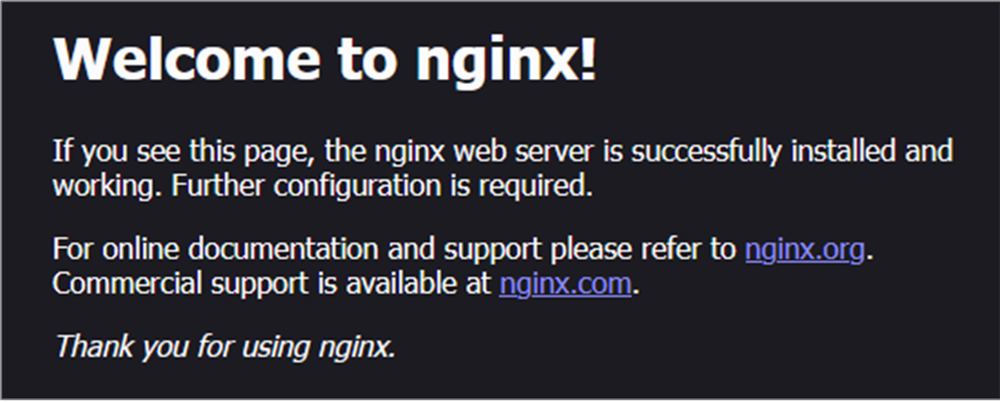

# はじめに
ここでは、NginxとElasticSearchをデプロイする。
デプロイ順は、以下となる。

・GitHubに「Nginx-ElasticSearch」リポジトリ作成

・Nginxモジュール化してデプロイ

・ElasticSearch イメージ取得
・Elasticsearch docker-compose作成
・Elasticsearch デプロイ アクセス確認
・ホスト側のポートを閉じて再デプロイ

・NginxにElasticsearch用モジュール追加してデプロイ
・アクセス確認


# 参考文献

# デプロイ手順

## 準備

Docker Networkをデザインし、デプロイする。
今回は、`ecosystem`というDocker Networkに`172.10.10.0 ~ 172.10.10.255`のサブネットを割り当てる。

```
[実行コマンド]
docker network create --subnet=172.10.10.0/24 --gateway=172.10.10.1 ecosystem

[結果]
d7178ec128c06b2ca63be8bcf778d58c2514f84623fbe2ed03162a77acfedd3a

[確認コマンド]
docker network inspect ecosystem

[結果]
[
    {
        "Name": "ecosystem",
        "Id": "d7178ec128c06b2ca63be8bcf778d58c2514f84623fbe2ed03162a77acfedd3a",
        "Created": "2024-09-22T10:36:58.129701695Z",
        "Scope": "local",
        "Driver": "bridge",
        "EnableIPv6": false,
        "IPAM": {
            "Driver": "default",
            "Options": {},
            "Config": [
                {
                    "Subnet": "172.10.10.0/24",
                    "Gateway": "172.10.10.1"
                }
            ]
        },
        "Internal": false,
        "Attachable": false,
        "Ingress": false,
        "ConfigFrom": {
            "Network": ""
        },
        "ConfigOnly": false,
        "Containers": {},
        "Options": {},
        "Labels": {}
    }
]
```

## Nginxモジュール化してデプロイ
まずは、Nginxをデプロイする。


### まずは、デプロイするためのdocker composeを作成する

Nginxをデプロイするための、モジュール群を別リポジトリに格納してある。
[Nginx-Module](https://github.com/halchil/Nginx-Module/tree/main)

このとき、モジュールから引っ張ってきた**volumeはコメントアウト**しておく。

```
[実行コマンド ディレクトリ移動]
cd Nginx-ElasticSearch/Nginx

[実行コマンド]
docker compose up -d

[結果]
WARN[0000] /home/mainte/Nginx-ElasticSearch/Nginx/docker-compose.yaml: `version` is obsolete 
[+] Running 1/1
 ✔ Container nginx  Started                          

[確認コマンド]
docker ps

[結果]
CONTAINER ID   IMAGE          COMMAND                  CREATED              STATUS         PORTS                               NAMES
87e322ba2240   nginx:latest   "/docker-entrypoint.…"   About a minute ago   Up 3 seconds   0.0.0.0:80->80/tcp, :::80->80/tcp   nginx
```

アクセスを確認する。

### volume用のnginx.confを作成する
`nginx.conf`をモジュール化しておく。
[Nginx Conf](https://github.com/halchil/Nginx-Module/tree/main/Nginx%20Conf)


(**待ち受けるIPをloacalhostから仮想マシンのIPに変更する必要があるか**)

モジュールを組み合わせることで、`nginx.conf`を作成

[nginx.conf](https://github.com/halchil/Nginx-ElasticSearch/blob/main/Nginx/nginx.conf)

`docker-compose.yaml`のvolume部分のコメントアウトを外してデプロイする。

```
[確認コマンド]
docker ps

[結果]
CONTAINER ID   IMAGE          COMMAND                  CREATED        STATUS        PORTS                               NAMES
9aa6258aad75   nginx:latest   "/docker-entrypoint.…"   11 hours ago   Up 11 hours   0.0.0.0:80->80/tcp, :::80->80/tcp   nginx
```

ブラウザにアクセスするアドレスは以下。
```
http://192.168.56.102:80
```
アクセスを確認する。



## ElasticSearch イメージ取得
次は、先ほどデプロイしたNginxのバックエンドとしてElasticSearchを接続するため、のイメージを取得する。

```
[実行コマンド]
docker pull elasticsearch:8.9.0

[確認コマンド]
docker image list

[結果]
REPOSITORY            TAG       IMAGE ID       CREATED         SIZE
...
elasticsearch         8.9.0     281908e9f34e   14 months ago   1.34GB
...
```

## ElasticSearch用のdocker-compise.yamlを作成

```
http://192.168.56.102:9200
```
